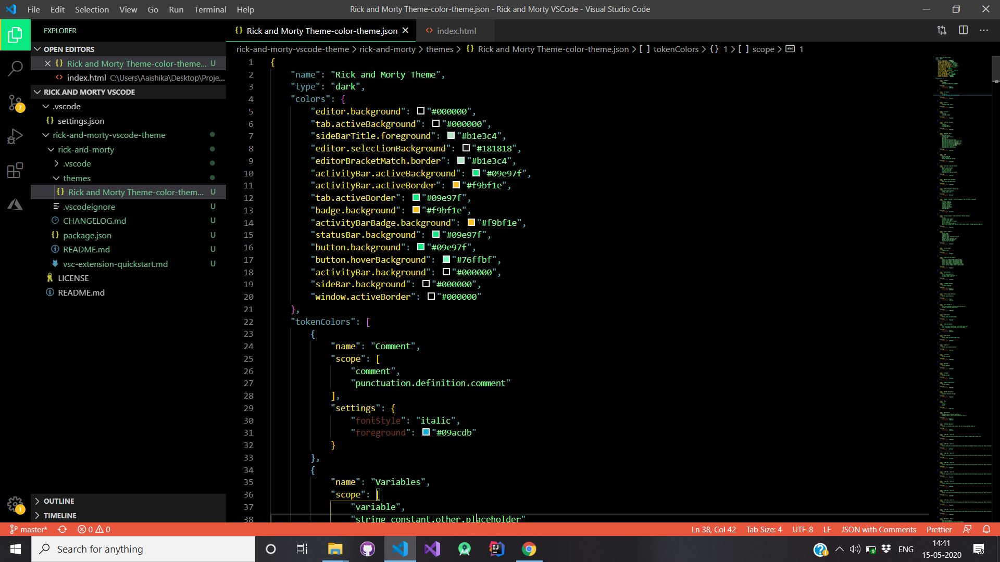
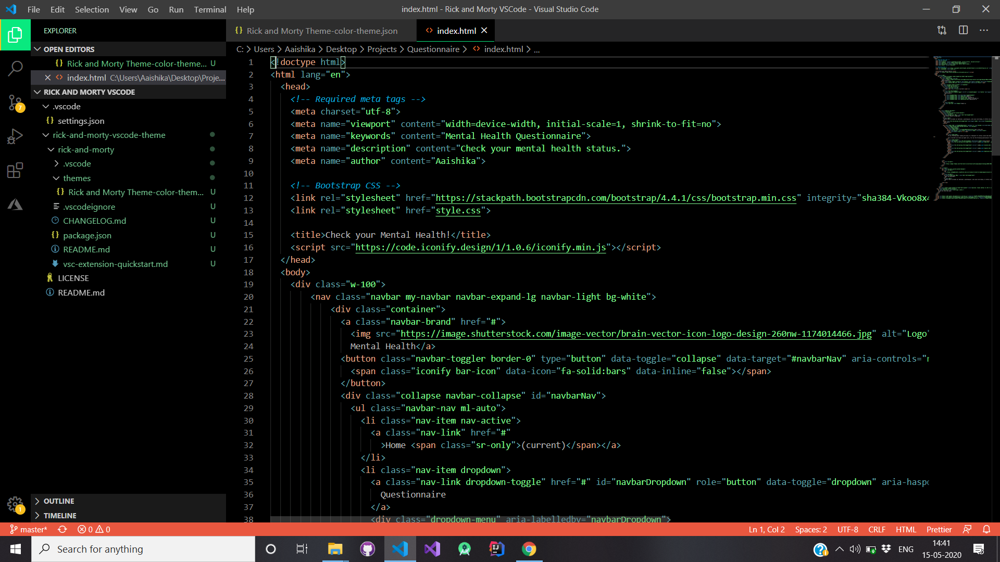

# Rick and Morty VSCode Theme
Look Morty I turned myself into a Visual Studio Code Color Theme!  

## Palettes
Colors for this Theme were chosen from the following Sources:
- [Colors Wall: Rick and Morty Palette](https://colorswall.com/palette/23454/)
- [Color Hex: Rick and Morty Color Palette](https://www.color-hex.com/color-palette/9134)
- [Colors Wall: Pallete #797](https://colorswall.com/palette/1535/)
